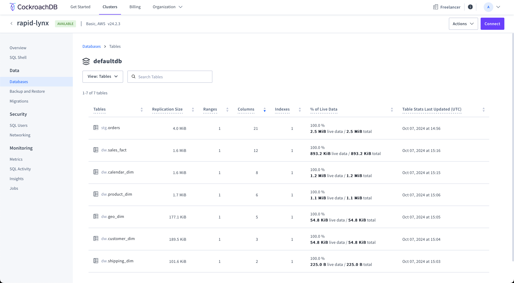

# Superstore in a cloud DB

The purpose of this learning project is to understand how to work with data modelling, export data to a cloud server and perform data analysis.

The materials and steps to build the project are taken from [Data Learn](https://github.com/Data-Learn/data-engineering)

## Creating Data Model

There are 3 possible types for creating a data model for Supestore (which you can find in the Excel project repository): 
- Third Normal Form (3NF).
- Dimensional model
- Data Warehouse

I chose the Dimensional model because:
- During my university studies we only worked with 3NF, so I am very familiar with this type. However, modelling and creating a database can be time consuming.
- I have never heard about Data Vault and how to work and implement a database based on this type.
- The lecturer from the Data Learn course offered some solutions on Dimensional model. In addition, I wanted to practice to understand how it works.

However, I made some assumptions because I find it quite difficult to build a new model based on the original data:
- No data from people and returns excel lists
- Additional unique columns with IDs to mitigate the dublicate values

## Export to the cloud DB

For demonstation purposes I found a good cloud DB service called [CockroachDB](https://cockroachlabs.cloud/). I created a PostgreSQL DB there, connected through DBeaver and perform actions below.

In [stg.orders.sql](stg.orders.sql) you will find the creation of a table with raw data from an excel file with orders (Created and inserted).

In [from_stg_to_dw](from_stg_to_dw) you will find the creation of a database with multiple tables based on dimensional modelling (Created and inserted).

## Perform analysis based on cloud DB

The lecturer from Data Learn offered several solutions to show how we can analyse data.

For the first time, I chose [Klipfolio](https://www.klipfolio.com/) service. However, I didn't like the fact that there are no enough graphs and settings to effectively present the data. In the future I will consider more practical and popular services such as Tableu, PowerBI, etc.

## Conclusion

With this training project I can understand how to model a database, how to export it to the cloud and analyse it. 

It is not essential for a beginner data analyst, however it gives a good understanding of how everything works. 

# UPDATED

Created tables with managers and returns. Added two more columns and inserted data to sales_fact.

Created dashboard in Tableau. 

## Tableau Dashboard

To better understand how to work with [Tableau](https://www.tableau.com), I used the free trial desktop version to import data from CockroachDB and run analysis like Klipfolio. 

I can say that Tableau is much better than Klipfolio in all aspects except the price.

You can find the dashboard in [tableau public](https://public.tableau.com/views/Superstore_17301309628110/Dashboard?:language=en-US&:sid=&:redirect=auth&:display_count=n&:origin=viz_share_link)

